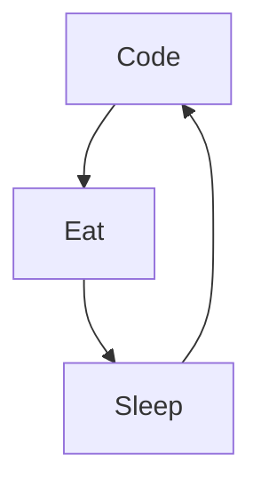

Actually:

- 🔭 Je suis actuellement en formation Js/React - @Wild_Code_School
- 🌱 Je suis actuellement à la recherche d'une formation en alternance 
- 👯 Mon objectif est de devenir développeur web Full Stack Ruby/RoR 
- 📫 Vous pouvez me contacter par : Linkedin & email 

### Languages et outils:

 
 

### My daily routine :

### ⭐ GitHub Stats

